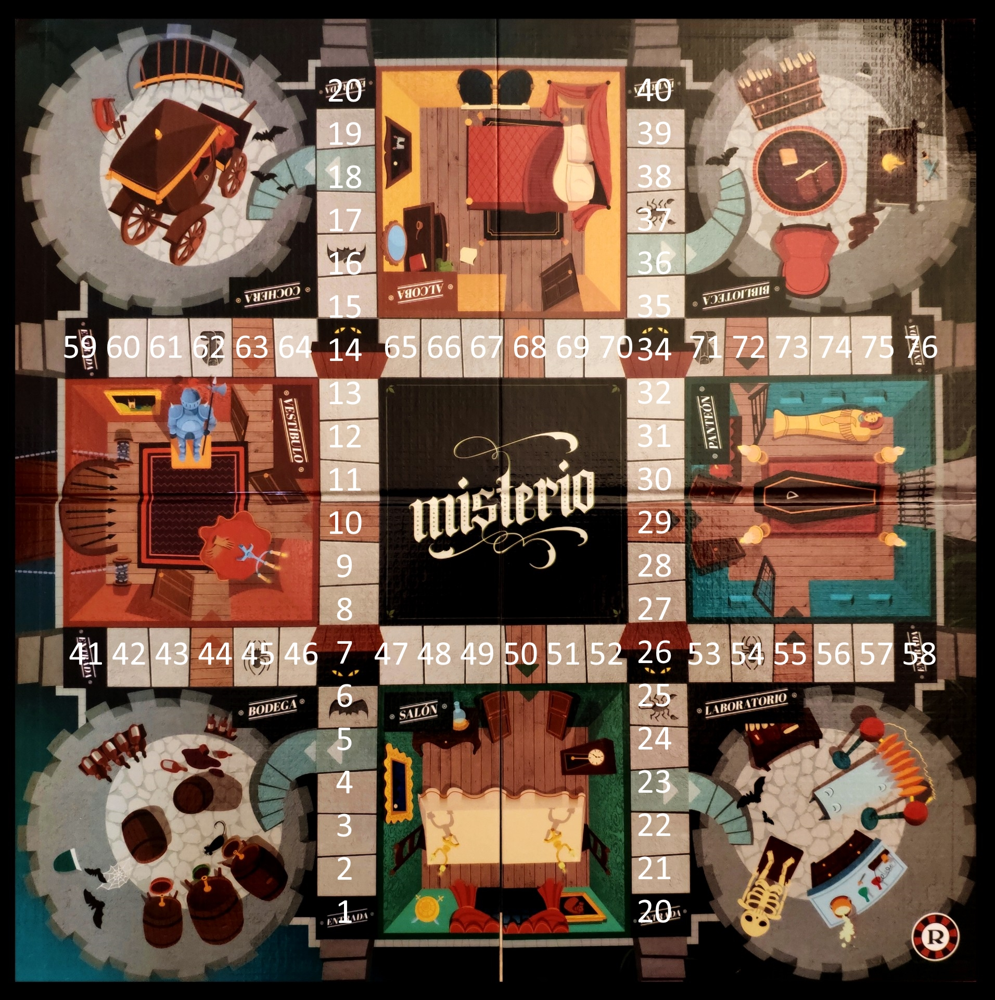

# Misterio backend

### Table of contents
- [Install](#install)
- [Run](#run)
- [Tests](#tests)
- [Notes for developers](#notes-for-developers)
- [Board organization](#board-organization)
- [Websockets protocol](#websockets-protocol)
  * [Definitions](#definitions)
  * [Lobby endpoint](#lobby-endpoint)
    + [Join lobby](#join-lobby)
    + [Create lobby](#create-lobby)
    + [Start match](#start-match)
  * [Match endpoint](#match-endpoint)
    + [Roll dice](#roll-dice)
    + [End turn](#end-turn)


# Install


- ```python -m pip install -r requirements.txt```

# Run


- ```python -m uvicorn main:app --reload```

# Tests


- ```python -m unittest discover tests/```

# Notes for developers


- All tests using the FastAPI test client should extend the TestCaseFastAPI class

# Board organization

There's a number assigned to every square in the board. If a player steps into a square
that leads to a room, that player is considered to be in that room



# Websockets protocol

## Definitions

Lobby:
``` {'name': str, 'host': str, 'current_players': int, 'players': [str] }```

Match:
```{'name': self.name, 'players': [str], 'turn': str, 'player_positions': {'player_name': int, ..} }```

Error:
```{'action': 'failed', 'info': str}```
* All endpoints return Error if there was one

## Lobby endpoint

### Join lobby

Takes: ```{'action': 'lobby_join', 'player_name': str, 
'lobby_name': str}```

Returns:

To sender

```{'action': 'joined_lobby', 'lobby': Lobby }```

To other players in the room

``` {'action': 'new_player', 'player_name': str} ```


### Create lobby
Takes: ```{'action': 'lobby_create', 'player_name': str, 'lobby_name': str}```

Returns:
```{'action': 'new_lobby', 'lobby': Lobby}```


### Start match

Takes: 
```{'action': 'lobby_start_match', 'player_name': str, 'lobby_name': str}```

Returns:

```{'action': 'match_started', 'match': Match }```

## Match endpoint

### Roll dice

Takes:
```{'action': 'match_roll_dice', 'match_name': str}```

Returns:

To every player in the match

```{'action': 'roll_dice', 'dice': int}```

### End turn

Description: Ends player's turn, returns whose turns it is next

Takes:
```{'action': 'match_end_turn', 'match_name': str}```

Returns:

To every player in the match

```{'action': 'turn_passed', 'current_turn': str}```